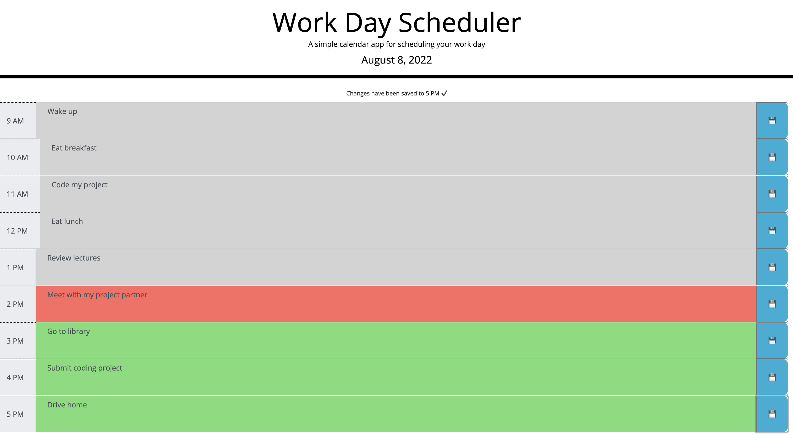
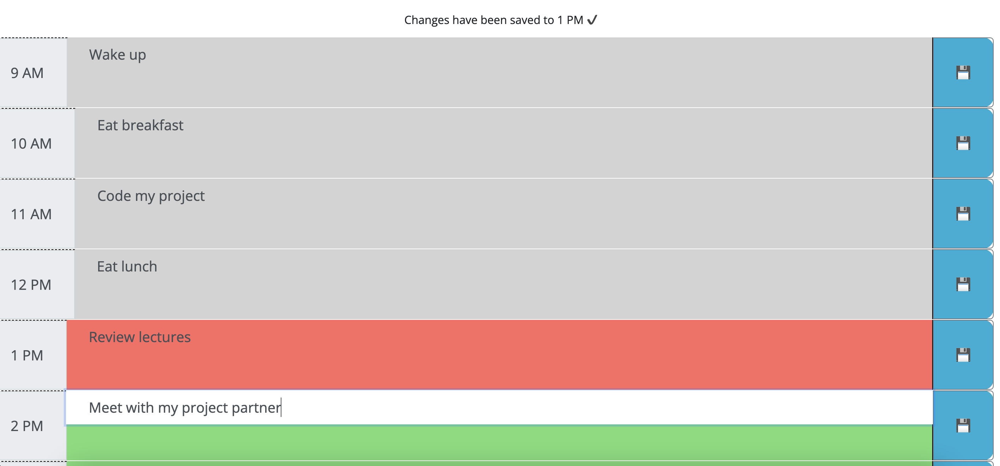
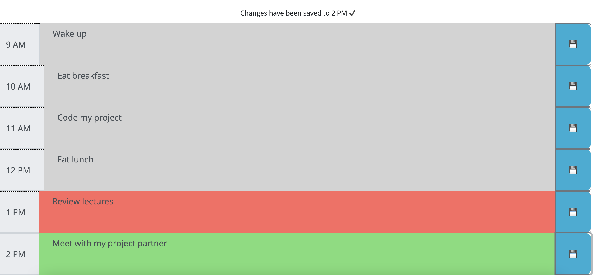
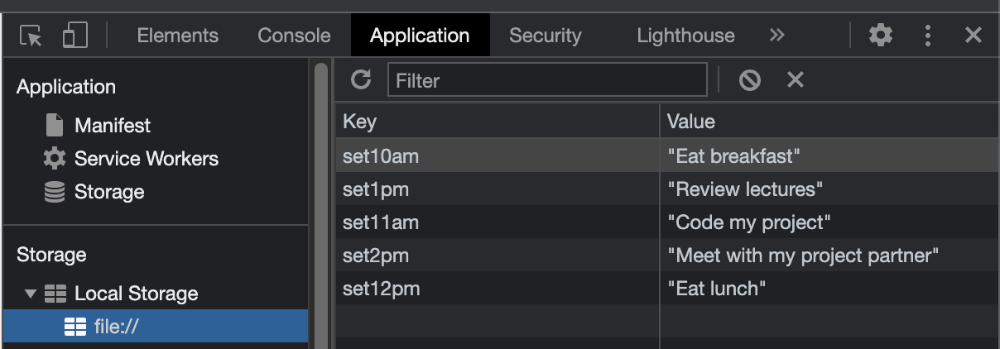
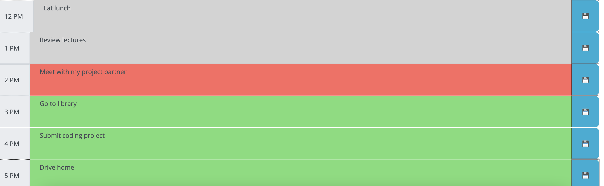

# Challenge Five: Work Day Scheduler

## Project Description

Challenge Five required us to develop the starter code into a simple calendar application that allows the user to slot tasks into their day and save them into local storage so that they can be viewed later. The time slots are color coded based on whether they will occur in the future, have occurred, or will occur within the current hour. 

### Application Screenshot

The following images shows the scheduler application:

### Save a Task

The following images shows a task being entered at 2pm. Once saved, a confirmation appearing with the relevant time. 

### Task Saved

The application saves the task into the user's local storage. 

### Page Reload

The tasks are retrieved upon page reload. The following gif shows a tasks being input, saved, and persisting after reloading the page.

### Color-coded Timeslots

Tasks in the future are color coded green. Tasks are grey if tasks are in the past. Tasks are red if they are scheduled in the current hour. The current time in this image is 2:00pm. 

### Link to Github Page
[https://jffsun.github.io/chall-five-scheduler/](https://jffsun.github.io/chall-five-scheduler/).

### Link to Github Repository
[https://github.com/jffsun/chall-five-scheduler](https://github.com/jffsun/chall-five-scheduler).